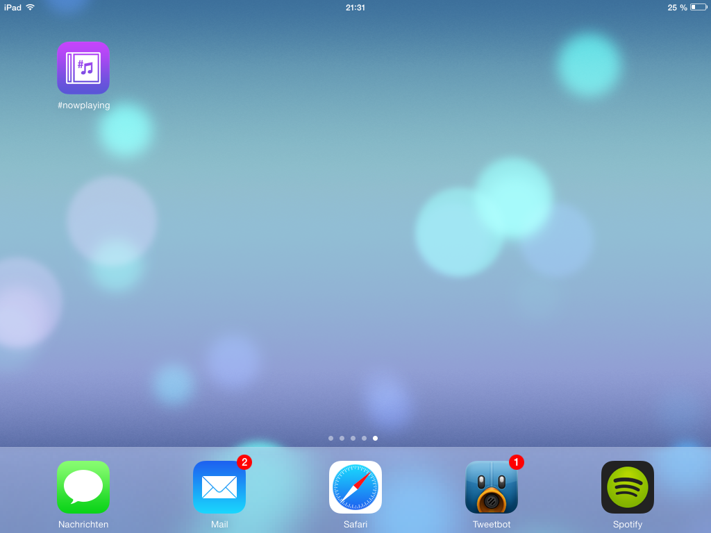

\#nowplaying
==========

##installation
Upload the directory "nowplaying" on your webserver running PHP 5 (or higher). Then edit lastfm.php – it's easy as 1-2-3!

##compatibility
###Server
PHP 5 or higher.
###Client
Works best with Safari or Google Chrome. WebKit recommended for best user-experience. HTML5 notifications currently only running on Safari.

##copyright
There's a picture included called 'festival.jpg'. I made the picture and allow you to use it in \#nowplaying however you want but I would like you not to use it in a commercial way or [mail me](mailto:nowplaying@jh0.eu "write me an email!") if you want to do so. Thank you!
See additional information in the LICENSE file.

##preview
")

HTML5 Notifications (Safari)

")
Preview (Chrome on Mac OS X)

")
Preview (Safari on Mac OS X)


Fullscreen WebApp on iPad 2


WebApp on Homescreen (iOS 7)

Visit my website for a [live preview](http://nowplaying.jh0.eu "live preview").

##API
I added an API file (`api.php`) for those who want to fetch their currently playing song easily. It supports three return formats, you can toggle them by using the `mode` parameter. 
e.g.: `http://nowplaying.your-website.com/api.php?mode=xml`.
####JSON
URL: `/api.php?mode=json`
```json
{
				"title": "Test The Limits",
				"artist": "The Ghost Inside",
				"album": "Get What You Give",
				"coverUrl": "http://userserve-ak.last.fm/serve/300x300/77027328.png"
}
```
####XML
URL: `/api.php?mode=xml`
```xml
<nowplaying>
	<title>Test The Limits</title>
	<artist>The Ghost Inside</artist>
	<album>Get What You Give</album>
	<coverUrl>
	http://userserve-ak.last.fm/serve/300x300/77027328.png
	</coverUrl>
</nowplaying>
```
####TXT
URL: `/api.php?mode=txt`
```
now playing: Test The Limits by The Ghost Inside took from Get What You Give
```

##FAQ
####Why does it take so long to refresh?
It gets the new meta information (song, album, artist, cover) every 4 seconds (the background refreshes every 5 seconds) to save the lastfm API from getting overloaded. It's also more reliable when it takes longer. You can change it in `index.html` if you know, what you're doing.
####How can I change the period of the top artists statistics?
Change `$period`in `lastfm.php` to either `overall`, `7day`, `1month`, `3month`, `6month` or `12month`.
####I found a bug!
[email me!](mailto:nowplaying@jh0.eu "write me an email!")
***
Have fun, 

Jannis
@Der_Hutt
